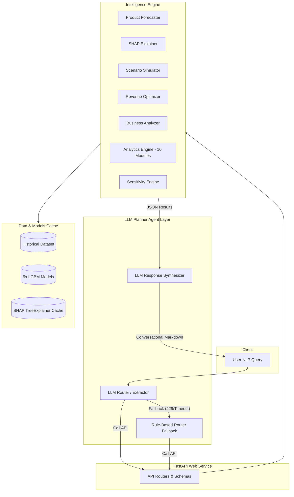

# Technical Documentation: AI-Powered Business Analytics Assistant ML Microservice

This document provides a comprehensive technical overview of the architecture, data pipeline, core intelligence engine, API service, and LLM Planner Agent layer built for the Business Analytics Assistant.

---

## 1. System Architecture & Design Philosophy

The microservice is designed as a standalone, stateless calculation engine. The core philosophy is **separation of concerns**: the language processing and synthesis are handled by LLM wrappers, while all math, statistical forecasting, optimizations, and analytics calculations are executed deterministically in Python using pre-trained LightGBM models, pandas, and SHAP. 



### Key Architectural Guidelines
1. **Stateless Execution**: The microservice caches dataset, model weights, and preprocessors in-memory upon startup (via FastAPI lifespan) to achieve sub-second execution.
2. **Type Safety & Alignment**: The forecasting engine aligns user adjustments (integers, floats, percentages) to match LightGBM input schemas precisely.
3. **Resilience**: The LLM Agent layer employs a fail-fast timeout strategy with deterministic fallback parsing. If NVIDIA NIM is rate-limited (429) or timed out, the endpoint returns raw calculations immediately.

---

## 2. Ingestion & Feature Engineering Pipeline

The system processes raw temporal business records (`temporal_dataset.csv`) through an automated feature engineering pipeline, producing **140+ predictive variables** across five domains:

* **Date & Calendar Features**: Extracting cyclic variables including `day_of_week`, `month`, `quarter`, and `is_weekend` flag.
* **Lag Features**: Multi-interval lag points (`[1, 7, 14, 30]` days) computed for the historical target variables and driver metrics to capture auto-regressive properties.
* **Rolling Features**: Moving average, standard deviation, maximum, and minimum computed over window spans of `[7, 14, 30]` days to smooth noise.
* **Marketing & Traffic Dynamics**: CTR (Click-Through Rate) trend ratios, ROAS (Return on Ad Spend) trend ratios, and traffic progression rates to measure channel efficacy.
* **Inventory & Operational Metrics**: Ratio of available stock to sales volumes (`inventory_ratio`) and forecasted days of remaining stock coverage (`stock_days`).
* **Pricing & Discount Buckets**: Categorical buckets based on discount ranges, and price indexes reflecting adjustments relative to historical medians.
* **Growth Vectors**: Day-over-day and week-over-week growth rates in revenue, order counts, and marketing spends.

The pipeline ensures all inputs are clean, scaling/encoding categorical columns while retaining purely numerical data vectors for the LightGBM models.

---

## 3. LightGBM Predictive Estimators

The service trains five independent, highly optimized **LightGBM Regressors** corresponding to five critical business KPIs:

| Target KPI | Description | Validation $R^2$ Score | Key Input Driver Features |
| :--- | :--- | :--- | :--- |
| **Revenue** | Forecasts aggregate product sales value | **0.9287** | Discount, price, marketing, lag revenues |
| **Profit** | Forecasts total product margin yield | **0.9459** | Product pricing, shipping fee, marketing spend |
| **Orders** | Forecasts purchase order volume count | **0.8385** | Discounts, marketing spend, traffic, lags |
| **Conversion Rate** | Predicts percentage of traffic converting | **0.9562** | Price, discount, CTR trends, weekend flags |
| **Retention Rate** | Predicts percentage of repeat purchases | **0.9849** | Price index, lag customer ratings, discount buckets |

* **Training Process**: The training pipeline splits historical data sequentially (temporal split) to prevent data leakage, trains estimators with early stopping (100 rounds), saves binary artifacts to the `models/` directory, and exports sample background reference data for the SHAP explainer.

---

## 4. The Intelligence Engine (Core Components)

The intelligence engine consists of seven highly specialized modules located under `src/core/`:

### 4.1. Product Forecaster (`forecaster.py`)
Computes recursive multi-step forecasts over a custom horizon (e.g., 30 days) for specific products.
* **Recursive Lag Updating**: For each step in the future horizon, the forecaster dynamically computes future lag/rolling averages based on prior steps' predictions.
* **Input Coercion**: Detects variable types (such as `discount_pct`) to match whether they are encoded as decimals (0-1) or percentages (0-100) and formats input arrays before inference.

### 4.2. Prediction Explainer (`explainer.py`)
Provides model explainability using Tree SHAP (SHAP value attributions).
* **Local Feature Importance**: Quantifies the contribution of each driver (e.g., discount, marketing, shipping) to a specific day's prediction.
* **Global Feature Importance**: Computes average absolute SHAP values across a validation sample to rank drivers globally.
* **Natural Language Driver Mapping**: Translates raw machine learning feature names (e.g., `revenue_lag_7`) into human-readable business terms (e.g., "Historical sales performance from 7 days ago").

### 4.3. Scenario Simulator (`simulator.py`)
Runs joint "what-if" counterfactual simulations by overriding driver values.
* **NLP Parsing**: Parses adjustments like `discount +5%`, `marketing +10%`, `shipping +20` into structured modifications.
* **Joint KPI Assessment**: Simulates the effects of these adjustments across all 5 models simultaneously, measuring the net impact on Revenue, Profit, Orders, Conversion Rate, and Retention Rate.

### 4.4. Revenue/Profit Optimizer (`optimizer.py`)
Performs bounded grid-searches to identify parameter combinations (marketing spend, discount rates, pricing) that maximize total forecasted revenue or profit.
* **Constrained Optimizations**: Restricts the search space to feasible boundaries (e.g., maximum 30% discount, budget capped at $250).

### 4.5. Business Analyzer (`analyzer.py`)
Provides Period-over-Period comparisons (e.g., comparing first half of the month to the second half) and fits linear slopes to historical trends to identify declining product lines.

### 4.6. Analytics Engine (`analytics/`)
Comprises ten targeted sub-modules delivering structured JSON summaries:
1. `kpi.py`: Period aggregates for total sales, conversions, and margins.
2. `trend.py`: Standard linear regressions, growth rates, and trajectories.
3. `benchmark.py`: Comparative metrics checking product performance against its category.
4. `seasonality.py`: Day-of-week, weekly, and monthly distribution ratios.
5. `channel.py`: Contribution statistics across platforms (Amazon, Website, Nykaa, Mobile App).
6. `campaign.py`: ROI metrics and ad spends.
7. `inventory.py`: Operational ratios, stockout risk alerts, and stock turnover metrics.
8. `customer.py`: Customer distribution, active counts, and LTV.
9. `marketing.py`: CTR, CPM, and ROAS correlation coefficients.
10. `pricing.py`: Elasticity estimates, pricing distributions, and sales volume by discount tier.

### 4.7. Sensitivity Engine (`sensitivity.py`)
Determines the elasticity of revenue relative to six primary drivers (Marketing, Discount, Shipping, Price, Inventory, Returns) by executing micro-perturbations ($+10\%$) on baseline values and compiling expected impact, elasticity scores, and statistical confidence intervals.

---

## 5. LLM Planner Agent Layer

The **LLM Planner Agent** ([planner.py](file:///c:/Users/Relanto/OneDrive%20-%20Relanto/new/sprint2_product_intel/src/core/agent/planner.py)) acts as the orchestrator mapping natural language queries to backend REST APIs.

### The Two-Step Execution Flow:
1. **Routing and Parameter Extraction**: Prompts the NIM Llama-3.1 model to analyze the user query and output a strict JSON payload indicating the `route` and structured extraction `params`.
2. **Deterministic Execution**: The agent calls the corresponding FastAPI helper module with the extracted parameters and fetches the structured JSON results.
3. **Response Synthesis**: Sends the query and raw JSON results back to the LLM to format a business-friendly markdown summary report.

### Fallback Mechanism:
To guarantee high availability and eliminate hangs under heavy API load, the Agent uses:
* **No Client Timeouts**: Set `timeout=None` in the OpenAI client constructor, ensuring slow responses or queue waits are never preemptively cut off on the model side.
* **Deterministic Fallback Parsing**: If the API call fails or is throttled (e.g. HTTP 429 Too Many Requests), the planner catches the exception and routes the query using a rule-based parser.
* **Formatted JSON Wrap**: If the final response synthesis fails, the agent formats the raw calculation results into a structured JSON string and returns it safely to the user with a warning.

---

## 6. API Routing Table

FastAPI exposes the core intelligence engine via the `/api/v1` prefix. Below is the registered endpoints map:

| Endpoint Path | Method | Schema/Payload | Output Object | Description |
| :--- | :--- | :--- | :--- | :--- |
| `/forecast/predict` | `POST` | `ForecastRequest` | `ForecastResponse` | Generates recursive multi-step forecasting |
| `/explanation/explain` | `POST` | `ExplanationRequest` | `ExplanationResponse` | Returns Tree SHAP feature attributions |
| `/explanation/global_importance`| `GET` | Query Parameter: `metric` | `GlobalImportanceResponse` | Returns average SHAP feature rankings |
| `/scenario/simulate` | `POST` | `SimulationRequest` | `SimulationResponse` | Simulates single-variable overrides |
| `/scenario/evaluate` | `POST` | `EvaluateScenarioRequest` | `EvaluateScenarioResponse` | Evaluates joint multi-KPI modifications |
| `/scenario/evaluate_batch` | `POST` | `EvaluateBatchRequest`| `EvaluateBatchResponse` | Evaluates multiple product/scenario sets |
| `/optimization/maximize` | `POST` | `OptimizationRequest` | `OptimizationResponse` | Bounded parameter grid search solver |
| `/analysis/compare` | `POST` | `ComparisonRequest` | `ComparisonResponse` | Period-over-period delta calculation |
| `/analysis/declining` | `POST` | `DecliningRequest` | `DecliningResponse` | Detects negative trend slope products |
| `/analytics/kpi` | `GET` | Optional Filters | `KPIAnalyticsResponse` | Generates summary aggregate KPIs |
| `/analytics/trend` | `GET` | Optional Filters | `TrendAnalyticsResponse` | Generates historical trajectories |
| `/analytics/benchmark` | `GET` | Optional Filters | `BenchmarkAnalyticsResponse` | Compares product against peer category |
| `/analytics/seasonality` | `GET` | Optional Filters | `SeasonalityAnalyticsResponse` | Calculates holiday and weekend ratios |
| `/analytics/channel` | `GET` | Optional Filters | `ChannelAnalyticsResponse` | Tracks platform revenue contributions |
| `/analytics/campaign` | `GET` | Optional Filters | `CampaignAnalyticsResponse` | Tracks marketing ROI & spend metrics |
| `/analytics/inventory` | `GET` | Optional Filters | `InventoryAnalyticsResponse` | Calculates stockout risk and stock days |
| `/analytics/customer` | `GET` | Optional Filters | `CustomerAnalyticsResponse` | Generates LTV and engagement figures |
| `/analytics/marketing` | `GET` | Optional Filters | `MarketingAnalyticsResponse` | Correlates spend to conversion trends |
| `/analytics/pricing` | `GET` | Optional Filters | `PricingAnalyticsResponse` | Displays sales volumes by discount tiers |
| `/sensitivity/estimate` | `POST` | `SensitivityRequest` | `SensitivityResponse` | Calculates driver elasticities |
| `/agent/query` | `POST` | `AgentQueryRequest` | `AgentQueryResponse` | Main NLP router/synthesis entrypoint |

---

## 7. Verification & Tests

The microservice includes **24 automated integration tests** located under `tests/test_api/`. These validate routing correctness, input sanitization, error responses, and agent routing fallbacks.

To run the full verification suite locally:
```bash
# Activate the virtual environment
.\venv\Scripts\Activate.ps1

# Run pytest
python -m pytest
```

All 24 tests execute and pass successfully.
