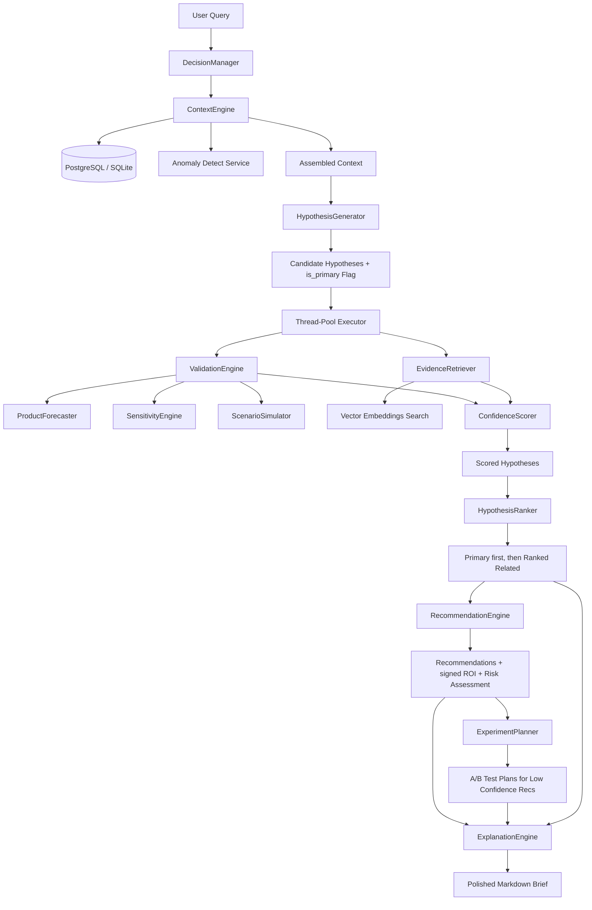

# Decision Intelligence Engine - Deep Technical Documentation

The Decision Intelligence (DI) Engine is a production-grade component of the Business Analytics Assistant. It coordinates historical anomaly detection, counterfactual predictive simulations, vector semantic experiment lookups, and Bayesian confidence scoring to generate actionable business recommendations and design rigorous A/B experiments.

---

## 1. High-Level System Architecture

The DI Engine coordinates multiple modular sub-engines. When a query is received, it runs a closed-loop analysis flow to produce an analytical executive brief.



---

## 2. Central Configuration

The DI Engine's parameters are controlled via `config/decision_config.yaml`. This centralizes weights, thresholds, and boundaries, ensuring python code remains clean.

### File: [decision_config.yaml](file:///c:/Users/Relanto/OneDrive - Relanto/new/sprint2_product_intel/config/decision_config.yaml)
- **Context Window**: Gathers 30-day baseline averages and 2% trend indicators.
- **Validation**: Simulation horizon (14 days), fallback change percentage (10%), and bounds (5% to 25%).
- **Weights**: Signal weights for overall confidence (Historical: 15%, Correlation: 20%, Sensitivity: 20%, Forecast: 25%, Causal: 20%).
- **Ranking Weights**: Rank score is weighted 60% on validation confidence and 40% on KPI impact magnitude.
- **Immediate Rollout Threshold**: A/B tests are skipped and immediate rollouts recommended if confidence exceeds `0.75`.
- **Elasticity Drivers**: Min driver deltas mapped to configuration keys (`discount_pct: 0.5`, `shipping_fee: 5.0`, `avg_selling_price: 1.0`, `marketing_spend: 100.0`).

---

## 3. Detailed Component Breakdown & Code

### A. System Coordinator
#### File: [manager.py](file:///c:/Users/Relanto/OneDrive - Relanto/new/sprint2_product_intel/src/core/decision/manager.py)
* **Purpose**: Coordinates the overall execution loop. It initializes all components, loads the dataframe once, parses query percentages/directions, runs validations in parallel using thread pools, and writes results to the database.
* **Key Implementation Details**:
  - Uses `threading.local` state passed to the validator to avoid concurrent database/dataframe clobbering.
  - Implements regular expressions to parse literal shocks (e.g. `15%`) and matches them to driver columns.
  - Submits evidence lookup and statistical validation to a `ThreadPoolExecutor`.

### B. Direction Parsing & String Matching
#### File: [direction_utils.py](file:///c:/Users/Relanto/OneDrive - Relanto/new/sprint2_product_intel/src/core/decision/direction_utils.py)
* **Purpose**: Provides word-boundary-safe regex patterns matching inflected keywords (e.g., "declines", "increasing") to detect user query intent and hypothesis directions, preventing false matches on sub-stems (e.g., "supported", "enterprise").
* **Core Code Structure**:
  ```python
  def get_word_pattern(word: str) -> str:
      if word.endswith('e'):
          stem = word[:-1]
          return rf"\b{stem}(?:e|es|ed|ing)?\b"
      elif word.endswith('y'):
          stem = word[:-1]
          return rf"\b{stem}(?:y|ies|ied|ying)?\b"
      elif word in ["drop", "cut"]:
          return rf"\b{word}s?\b|\b{word}{word[-1]}ing\b|\b{word}{word[-1]}ed\b"
      else:
          return rf"\b{word}(?:s|es|d|ed|ing)?\b"
  ```
- `parse_query_driver_direction`: Looks at a local context window (4 words before and 3 words after the driver keyword) to identify the direction.
- `parse_hypothesis_direction`: Looks at the suffix after the driver keyword, prioritizing the word closest to the KPI at the end of the sentence.

### C. Context Engine
#### File: [context/engine.py](file:///c:/Users/Relanto/OneDrive - Relanto/new/sprint2_product_intel/src/core/decision/context/engine.py)
* **Purpose**: Pulls daily core KPIs, scans the dataset using the anomaly detection service for recent anomalies (last 30 days), and retrieves pre-computed rolling trends.
* **Core Logic**:
  - `get_latest_kpis`: Invokes `HistoryManager.get_kpi_snapshot` to average values over a rolling window.
  - `get_recent_anomalies`: Iterates through core KPIs (revenue, profit, orders, conversion_rate) and calls `detect_anomalies`.
  - `get_rolling_trends`: Extracts trend directions and slope coefficients from the `Pattern` table.

### D. Hypothesis Generator (LLM & Fallback)
#### File: [hypothesis/generator.py](file:///c:/Users/Relanto/OneDrive - Relanto/new/sprint2_product_intel/src/core/decision/hypothesis/generator.py)
* **Purpose**: Generates candidate hypotheses mapping to database variables (`discount_pct`, `shipping_fee`, `avg_selling_price`, `marketing_spend`).
* **Core Logic**:
  - Invokes Llama 3.1 instruct model via NVIDIA NIM or falls back to rules-based template hypotheses if the API key is missing.
  - Checks if the user query targets a specific driver. Candidates matching that driver are marked `is_primary = True`; others are marked `is_primary = False` (Related Opportunities).

### E. Evidence Retriever (Semantic Similarity)
#### File: [evidence/retriever.py](file:///c:/Users/Relanto/OneDrive - Relanto/new/sprint2_product_intel/src/core/decision/evidence/retriever.py)
* **Purpose**: Queries the vector index database to fetch matching historical experiments.
* **Core Logic**:
  - Builds an enriched query appending the affected KPIs (e.g. "What happens if we cut shipping fees affecting mean_conversion_rate").
  - Boosts semantic similarity scores by `+0.10` if the experiment's results directly match the hypothesis target KPIs.

### F. Validation Engine (Statistical Counterfactuals)
#### File: [validation/validator.py](file:///c:/Users/Relanto/OneDrive - Relanto/new/sprint2_product_intel/src/core/decision/validation/validator.py)
* **Purpose**: Validates candidate hypotheses using thread-safe, multi-pronged data analytics.
* **Core Validation Methods**:
  1. **Correlation**: Calculates Pearson and Spearman coefficients plus Mutual Information score.
  2. **Sensitivity**: Resolves pre-calculated product-specific elasticities.
  3. **Causal Effect**: Compares top 33.3% vs bottom 33.3% driver values to proxy Average Treatment Effect (ATE), computing statistical significance using Welch's T-Test.
  4. **Forecast Simulation**: Runs counterfactual forecast simulations on the baseline models. Uses the query-parsed literal shock when available, otherwise falls back to data-driven IQR calculations.

### G. Confidence Scorer
#### File: [confidence/scorer.py](file:///c:/Users/Relanto/OneDrive - Relanto/new/sprint2_product_intel/src/core/decision/confidence/scorer.py)
* **Purpose**: Generates a composite `0.0` - `1.0` confidence score based on the weighted sum of Historical, Correlation, Sensitivity, Forecast, and Causal alignment.
* **Contradiction Penalty**:
  - Checks title direction alignment against the counterfactual forecast simulation delta.
  - If a hypothesis contradicts the forecast simulation delta direction (e.g., title suggests "increase revenue" but simulation delta is negative), the forecast score is penalized to `10.0`.
  - Ambiguous / neutral titles default to a moderate forecast score of `50.0`.

### I. Pure Risk Classifier
#### File: [recommendation/risk_classifier.py](file:///c:/Users/Relanto/OneDrive - Relanto/new/sprint2_product_intel/src/core/decision/recommendation/risk_classifier.py)
* **Purpose**: A pure, stateless classifier mapping confidence, volatility, and reversibility to risk levels:
  ```python
  class RiskClassifier:
      def classify(self, confidence: float, volatility: str, reversibility: str) -> str:
          vol = volatility.upper()
          if vol == "HIGH" or confidence < 0.60:
              return "High"
          elif vol == "MEDIUM" or confidence < 0.75:
              return "Medium"
          return "Low"
  ```

### H. Recommendation Engine
#### File: [recommendation/engine.py](file:///c:/Users/Relanto/OneDrive - Relanto/new/sprint2_product_intel/src/core/decision/recommendation/engine.py)
* **Purpose**: Translates prioritized hypotheses into recommendations (pricing adjustments, campaigns, budget changes, fulfillment optimization) with properly signed ROI expectations.
* **Core Logic**:
  - Formulates tactical copy, specifies rollback guidelines from the config file, and delegates to the `risk_classifier` to assign Low/Medium/High risk categories.

### J. Hypothesis Ranker
#### File: [ranking/ranker.py](file:///c:/Users/Relanto/OneDrive - Relanto/new/sprint2_product_intel/src/core/decision/ranking/ranker.py)
* **Purpose**: Sorts candidate opportunities.
* **Core Logic**:
  - Places `is_primary=True` opportunities at the top, sorted by their composite rank score.
  - Pluralizes related opportunities (`is_primary=False`) below primary opportunities, using causal ATE magnitudes for tie-breaking.

### K. A/B Test Planner
#### File: [planner/ab_planner.py](file:///c:/Users/Relanto/OneDrive - Relanto/new/sprint2_product_intel/src/core/decision/planner/ab_planner.py)
* **Purpose**: Designs structured A/B tests if the validation confidence of a recommendation is below the rollout threshold.
* **Power Analysis**: Calculates variant sample sizes using a two-proportion Z-test:
  $$n = \frac{\left(z_{\alpha/2} \sqrt{2p_{pooled}(1-p_{pooled})} + z_{\beta} \sqrt{p_1(1-p_1) + p_2(1-p_2)}\right)^2}{(p_1 - p_2)^2}$$
  Calculates required duration using daily orders proxies from context metadata.

### L. Explanation Engine
#### File: [explanation/explainer.py](file:///c:/Users/Relanto/OneDrive - Relanto/new/sprint2_product_intel/src/core/decision/explanation/explainer.py)
* **Purpose**: Compiles a markdown analytical brief.
* **Core Logic**:
  - Leverages Llama 3.1 instruct model or local fallback layouts to separate output tables, detailed descriptions, and risk assessments into **Primary Opportunities** and **Related Opportunities**.

---

## 4. End-to-End Execution Trace

### Example Query
`"What will happen to our revenue and profit if we increase discounts by 15%?"`

### Trace Steps
1. **Context Assembly**:
   - `ContextEngine` fetches the baseline KPI snapshot (e.g. Revenue: \$12,000, Conversion Rate: 3.2%, avg_discount_pct: 12.0%).
   - Scans for 30-day anomalies and identifies an active "Conversion Drop Anomaly".
   - Retrieves pattern trend directions ("stable" revenue, "decreasing" orders).
   - Generates a context object and saves a `DecisionContext` record to the database.

2. **Query Shock and Direction Parsing**:
   - `DecisionManager` parses query patterns and matches the `15%` percentage.
   - Identifies `"discount"` in the query and runs `parse_query_driver_direction`.
   - The preceding context is `"if we increase"`, which resolves to `"positive"`.
   - Records `query_pcts["discount_pct"] = 15.0`.

3. **Candidate Generation**:
   - `HypothesisGenerator` generates candidate hypotheses (e.g., `HYP_DIS_01` "Higher discounts increase Order Volume" and `HYP_PRI_01` "Price increases decrease Customer Conversion").
   - Matches driver variables against the parsed query context.
   - Mapped candidate `HYP_DIS_01` has `driver_variable="discount_pct"`, matching the scoped query driver, and is flagged with `is_primary = True`.
   - `HYP_PRI_01` (driver variable `"avg_selling_price"`) is flagged with `is_primary = False` (Related Opportunities).

4. **Parallel Validation**:
   - `EvidenceRetriever` runs semantic lookups on candidates. Finds a matching historical experiment (e.g., "Tested 10% discount promo resulting in a POSITIVE outcome") and boosts its similarity score by `+0.10`.
   - `ValidationEngine` validates candidates.
     - For `HYP_DIS_01` (`driver_col="discount_pct"`), since it's present in `query_pcts`, it sets `change_pct = 15.0` (skipping the fallback IQR perturbation).
     - Counterfactual forecaster forecast is run:
       - **Baseline Forecast**: \$288,864.66.
       - **Simulated Forecast** (with `discount_pct` increased to 15%): \$299,336.82.
       - **Forecast Delta**: +\$10,472.16 (+3.63% revenue shift).
     - Tertile splitting ATE causal Welch's T-test calculations are run, yielding an ATE estimate of 10,472.16 with a p-value of `0.02`.

5. **Confidence Scoring**:
   - `ConfidenceScorer` scores validation outputs.
     - `HYP_DIS_01` ("Higher discounts increase Order Volume") expects positive growth. The forecast simulation delta is `+3.63%`. The directions align, yielding a forecast score of `100.0`.
     - `ConfidenceScorer` runs `parse_hypothesis_direction` on candidates.
       - `HYP_PRI_01` ("Price increases decrease Customer Conversion") expects a decrease. If the simulation delta is positive, it receives a contradiction penalty (forecast score = `10.0`).
     - Composite confidence score is calculated:
       $$\text{overall\_confidence} = 0.15 \times 90.0 + 0.20 \times 40.0 + 0.20 \times 50.0 + 0.25 \times 100.0 + 0.20 \times 98.0 = 80.1\% \rightarrow 0.8010$$

6. **Prioritized Ranking**:
   - `HypothesisRanker` prioritizes candidates:
     - Sorts by `is_primary=True` first, followed by `is_primary=False`.
     - `HYP_DIS_01` is prioritized at the top of **Primary Opportunities**.
     - `HYP_PRI_01` is sorted below under **Related Opportunities**.

7. **Recommendation Formulation**:
   - `RecommendationEngine` processes ranked list.
   - For `HYP_DIS_01`, it calculates `estimated_roi`:
     - Since target KPI is revenue, `estimated_roi = round(expected_delta) = $10,472.16`.
     - Resolves historical success rate from the database.
     - Volatility is set to `"LOW"` (revenue delta 3.63% is < 5%). Reversibility is set to `"EASY"` for promotional campaigns.
     - Calls `risk_classifier.classify(confidence=0.8010, volatility="LOW", reversibility="EASY")`, returning `"Low"` risk.
   - For a hypothetical negative impact candidate, the expected ROI would be signed negative (e.g. `-$5,000`).

8. **A/B Test Design**:
   - Checks if recommendation confidence exceeds the rollout threshold.
   - Since confidence ($0.8010$) is $\ge$ rollout threshold ($0.75$), `needs_experimentation` is set to `False` (immediate rollout recommended).
   - If confidence had been lower, `ExperimentPlanner` would calculate the sample size using Z-proportion calculations, returning sample sizes and test duration requirements.

9. **Brief Generation**:
   - `ExplanationEngine` compiles the markdown report, grouping output tables, detailed descriptions, rollback instructions, and risk assessments into **Primary Opportunities** and **Related Opportunities**.
