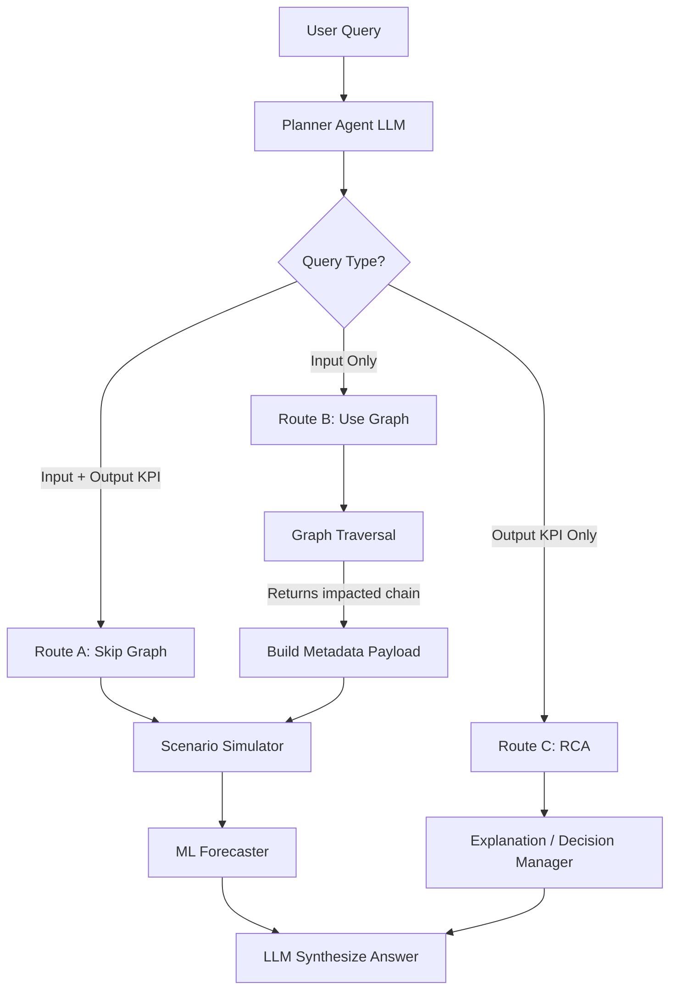
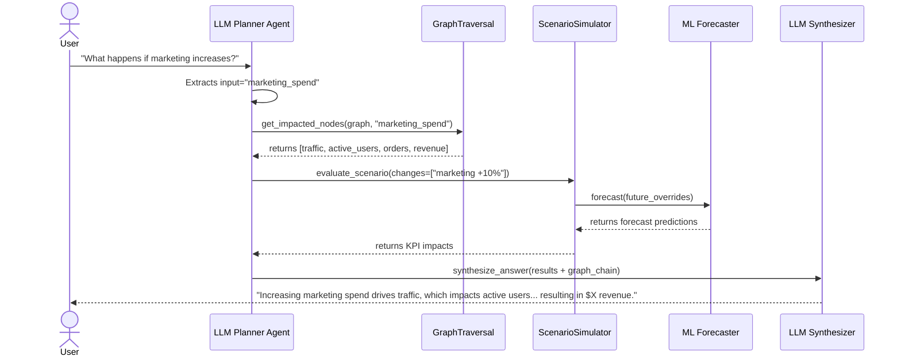

# Dependency Graph Integration Plan

## 1. Files Requiring Modification

### `product-intel/src/api/dependencies.py`
- **Purpose**: Load the graph at startup and inject the dependencies into the LLM Planner Agent.
- **Changes**:
  - Import `load_dependency_graph` from `dep_graph.load_graph`.
  - Import `GraphTraversal` from `dep_graph.graph.traversal`.
  - Add `dependency_graph` and `graph_traversal` to the `AppState` class.
  - Modify `load_app_state()` to initialize the graph and traversal instances.
  - Inject both instances into the initialization of `LLMPlannerAgent`.

### `product-intel/src/core/agent/planner.py`
- **Purpose**: Update the LLM routing logic and execution flow to incorporate the graph traversal.
- **Changes**:
  - Update the `LLMPlannerAgent.__init__` signature to accept `dependency_graph` and `graph_traversal`.
  - Update `system_prompt` in `route_and_extract` for `scenario_evaluate` to extract both the `input_variable` (e.g., 'marketing_spend') and `target_kpi` (if present).
  - Modify `execute_route` under the `scenario_evaluate` block to conditionally query the graph (Route B) vs skip the graph (Route A).
  - Update `synthesize_answer` prompt so the LLM is instructed to use the provided multi-hop graph chain to explain *how* the input impacts the output.

---

## 2. Planner Decision Points & Logic

The routing engine (LLM Prompt) will be enhanced to distinguish between queries that contain a target KPI and those that do not. 

### Route A: Input Variable AND Output KPI
- **Condition**: User query specifies both sides (e.g., "If I reduce price by 10%, what happens to revenue?").
- **Action**: Bypass `GraphTraversal`. The planner directly calls `simulator.evaluate_scenario(...)` to calculate the impact. 

### Route B: Input Variable BUT NO Output KPI
- **Condition**: User query specifies only the input (e.g., "What happens if marketing spend increases?").
- **Action**: The planner invokes `GraphTraversal.get_impacted_nodes()` with the extracted `input_variable`. It appends the returned logical chain (e.g., marketing_spend -> traffic -> orders -> revenue) to the execution metadata. Then it calls `simulator.evaluate_scenario(...)`.

### Route C: Output KPI ONLY (RCA)
- **Condition**: User query specifies only a target KPI indicating an anomaly or decline (e.g., "Why did revenue drop?").
- **Action**: Do NOT use the dependency graph. Route to `explanation_explain` or `decision_ask` which utilize SHAP and historical comparisons.

---

## 3. Dependency Injection Changes

The global `AppState` object acts as an in-memory cache to ensure the graph isn't redundantly loaded on every API request. 

```python
# In dependencies.py
class AppState:
    # ... existing state
    dependency_graph = None
    graph_traversal = None

def load_app_state():
    # ... existing init code ...
    
    if AppState.dependency_graph is None:
        import sys
        sys.path.append(os.path.abspath(os.path.join(os.path.dirname(__file__), "../../../../dep_graph")))
        from load_graph import load_dependency_graph
        AppState.dependency_graph = load_dependency_graph()
        
    if AppState.graph_traversal is None:
        from graph.traversal import GraphTraversal
        AppState.graph_traversal = GraphTraversal()
        
    if AppState.planner_agent is None:
        AppState.planner_agent = LLMPlannerAgent(
            # ... existing dependencies
            dependency_graph=AppState.dependency_graph,
            graph_traversal=AppState.graph_traversal
        )
```

---

## 4. How Graph is Loaded at Startup

The graph is a serialized joblib pickle object (`dependency_graph.pkl`).
During the FastAPI startup lifecycle (or the first invocation of `load_app_state()`), `load_dependency_graph()` is called. It loads the `networkx.DiGraph` into memory exactly once and assigns it to `AppState.dependency_graph`.

---

## 5. How GraphTraversal is Exposed to Planner

`GraphTraversal` is a stateless utility class. It is instantiated once during startup in `dependencies.py` and passed down to the `LLMPlannerAgent` via dependency injection in its constructor. The `LLMPlannerAgent` stores it as an instance attribute (`self.graph_traversal`), allowing seamless access during `execute_route()`.

---

## 6. Request Flow Diagrams



---

## 7. Sequence Diagram (Route B Focus)



---

## 8. Exact Call Chain

1. **`LLMPlannerAgent.process_query(query)`**: Initiates the workflow.
2. **`LLMPlannerAgent.route_and_extract(query)`**: The LLM detects a scenario with no specific target KPI. Returns JSON: `{"route": "scenario_evaluate", "params": {"changes": ["marketing +10%"], "input_variable": "marketing_spend"}}`.
3. **`LLMPlannerAgent.execute_route(route, params)`**: 
   - Calls `self.graph_traversal.get_impacted_nodes(self.dependency_graph, "marketing_spend")`.
   - Returns a list like `[{"node": "traffic", "score": 0.8}, {"node": "revenue", "score": 0.5}]`.
   - Calls `self.simulator.evaluate_scenario(..., changes=["marketing +10%"])`.
4. **`ScenarioSimulator.evaluate_scenario(...)`**: Evaluates the quantitative impact using the ML models.
5. **`LLMPlannerAgent.execute_route(route, params)`**: Packages both the simulator's output numbers and the graph's multihop node chain into a `raw_data` dictionary.
6. **`LLMPlannerAgent.synthesize_answer(query, route, raw_data)`**: The LLM reads the multi-hop chain and numerical forecasts, translating them into a business narrative.

---

## 9. Risks and Edge Cases

- **Node Name Discrepancies**: The variables extracted by the Planner LLM (e.g., `marketing`) must be successfully mapped to the exact node names in `dependency_graph.pkl` (e.g., `marketing_spend`). If they fail to map, the traversal will silently return an empty list.
  - *Mitigation*: Hardcode a mapping dictionary in `planner.py` or instruct the LLM specifically on the exact variable names available in the schema.
- **Python Path Import Issues**: The `dep_graph` package is located outside of the `product-intel/src` directory. Loading it inside `dependencies.py` requires safely appending the sibling directory to `sys.path`.
- **LLM Context Distraction**: Passing a dense chain of nodes with confidence scores to the synthesizer LLM could confuse it. 
  - *Mitigation*: Format the graph output clearly in the execution dictionary (e.g., `Causal Chain Context: marketing_spend -> traffic -> orders -> revenue`) before it reaches the synthesizer.
- **Target KPI Extraction Limits**: The LLM routing prompt might struggle to differentiate between Route A and Route B if the user ambiguously specifies a target KPI ("What happens to my numbers?").
  - *Mitigation*: Make Route B the default fallback behavior for `scenario_evaluate` queries whenever an explicit KPI (Revenue, Profit, Orders) is not isolated.
