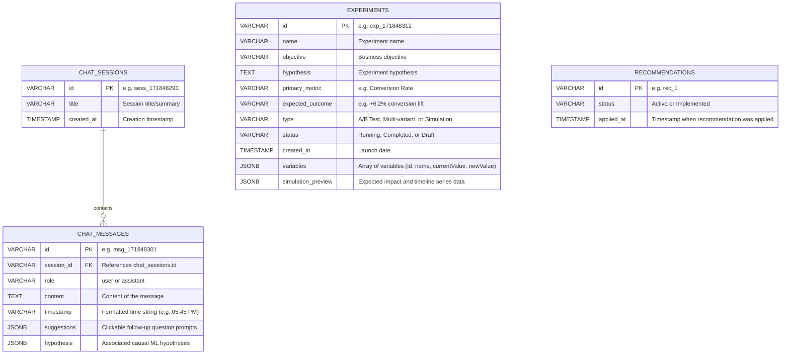

# Database Schema Design for Product Intelligence OS

This document details the relational database schema design used for state persistence in the Product Intelligence OS backend. The database is hosted on Neon PostgreSQL and managed using SQLAlchemy and Alembic.

---

## 1. Entity Relationship Diagram (ERD)

---

## 2. Table Specifications

### 2.1 Table: `chat_sessions`
Stores chat session metadata for the AI Workspace page.

| Column | Data Type | Constraints | Description |
| :--- | :--- | :--- | :--- |
| `id` | `VARCHAR(64)` | `PRIMARY KEY` | Unique identifier for the chat session. |
| `title` | `VARCHAR(255)` | `NOT NULL` | Human-readable title of the chat thread. |
| `created_at` | `TIMESTAMP` | `DEFAULT CURRENT_TIMESTAMP` | When the session was initialized. |

### 2.2 Table: `chat_messages`
Stores message history for each chat session.

| Column | Data Type | Constraints | Description |
| :--- | :--- | :--- | :--- |
| `id` | `VARCHAR(64)` | `PRIMARY KEY` | Unique message identifier. |
| `session_id` | `VARCHAR(64)` | `FOREIGN KEY` references `chat_sessions(id) ON DELETE CASCADE` | Associated chat session. |
| `role` | `VARCHAR(20)` | `NOT NULL` | Role of sender: `user` or `assistant`. |
| `content` | `TEXT` | `NOT NULL` | The message text. |
| `timestamp` | `VARCHAR(32)` | `NOT NULL` | Formatted display time (e.g., `05:45 PM`). |
| `suggestions` | `JSONB` | `NULLABLE` | List of suggested follow-up questions. |
| `hypothesis` | `JSONB` | `NULLABLE` | Embedded hypothesis objects generated by the ML engine. |

### 2.3 Table: `experiments`
Stores launched causal simulations and A/B test experiments.

| Column | Data Type | Constraints | Description |
| :--- | :--- | :--- | :--- |
| `id` | `VARCHAR(64)` | `PRIMARY KEY` | Unique experiment identifier. |
| `name` | `VARCHAR(255)` | `NOT NULL` | Name of the experiment. |
| `objective` | `VARCHAR(255)` | `NOT NULL` | Business goal. |
| `hypothesis` | `TEXT` | `NOT NULL` | Statement being tested. |
| `primary_metric` | `VARCHAR(100)` | `NOT NULL` | The main KPI to measure (e.g., `Conversion Rate`). |
| `expected_outcome` | `VARCHAR(100)` | `NULLABLE` | Estimated lift expected. |
| `type` | `VARCHAR(50)` | `NOT NULL` | Simulation or live test indicator. |
| `status` | `VARCHAR(30)` | `NOT NULL` | Current status (`Running`, `Completed`, `Draft`). |
| `created_at` | `TIMESTAMP` | `DEFAULT CURRENT_TIMESTAMP` | Launch date. |
| `variables` | `JSONB` | `NOT NULL` | Variable settings array (`name`, `currentValue`, `newValue`). |
| `simulation_preview` | `JSONB` | `NULLABLE` | Cached output metrics from the ML simulation model. |

### 2.4 Table: `recommendations`
Tracks the implementation status of recommended optimization plays.

| Column | Data Type | Constraints | Description |
| :--- | :--- | :--- | :--- |
| `id` | `VARCHAR(64)` | `PRIMARY KEY` | Unique ID (matching frontend mock recommendation IDs, e.g., `rec_1`). |
| `status` | `VARCHAR(30)` | `NOT NULL` | State: `Active` or `Implemented`. |
| `applied_at` | `TIMESTAMP` | `NULLABLE` | Time recommendation was marked as implemented. |
