    # BUSINESS WORLD SIMULATOR - SYSTEM FLOW

```mermaid
flowchart TD

%% =====================================================
%% PHASE 0
%% =====================================================

A[Product Archetypes] --> B[Product Generator]

B --> C[Product Instances]

C --> D[Baseline Market Generator]

%% =====================================================
%% BASELINE WORLD
%% =====================================================

D --> E[Generate Initial State]

E --> F[Seasonality Engine]

E --> G[Market Condition Engine]

E --> H[Noise Engine]

F --> I[Baseline Trajectory Generator]
G --> I
H --> I

I --> J[Baseline Timeline]

%% =====================================================
%% ACTION GENERATION
%% =====================================================

J --> K[Anchor Point Selection]

K --> L[Action Scenario Generator]

L --> M[Simple Scenarios]

L --> N[Medium Scenarios]

L --> O[Complex Scenarios]

L --> P[Stress Scenarios]

M --> Q[Action Schedule]
N --> Q
O --> Q
P --> Q

%% =====================================================
%% CAUSAL ENGINE
%% =====================================================

Q --> R[Causal Knowledge Base]

R --> S[Impulse Response Library]

S --> T[Effect Curves]

%% =====================================================
%% SIMULATION
%% =====================================================

J --> U[Anchor State]

U --> V[State Transition Engine]

Q --> V

T --> V

F --> V

G --> V

H --> V

%% =====================================================
%% MARKET PROPAGATION
%% =====================================================

V --> W[Controllable State Effects]

W --> X[Market State Dependency Graph]

X --> Y[Interaction Engine]

Y --> Z[Next State]

Z --> AA[Trajectory Builder]

AA --> AB[Future State]

AB --> AC{More Days Remaining?}

AC -->|Yes| V

AC -->|No| AD[Completed Trajectory]

%% =====================================================
%% DATASET CREATION
%% =====================================================

AD --> AE[Trajectory Repository]

AE --> AF[Window Generator]

AF --> AG[Training Dataset]

%% =====================================================
%% MODEL TRAINING
%% =====================================================

AG --> AH[Persistence Baseline]

AG --> AI[Linear Models]

AG --> AJ[XGBoost]

AG --> AK[LightGBM]

AG --> AL[CatBoost]

AG --> AM[TFT]

AG --> AN[TiDE]

AG --> AO[PatchTST]

AG --> AP[World Model]

%% =====================================================
%% EVALUATION
%% =====================================================

AH --> AQ[Benchmark Engine]

AI --> AQ

AJ --> AQ

AK --> AQ

AL --> AQ

AM --> AQ

AN --> AQ

AO --> AQ

AP --> AQ

AQ --> AR[Metrics]

AR --> AS[MAE]

AR --> AT[RMSE]

AR --> AU[SMAPE]

AR --> AV[WAPE]

AR --> AW[Trajectory Accuracy]

AR --> AX[Intervention Accuracy]

%% =====================================================
%% EXPLAINABILITY
%% =====================================================

AQ --> AY[Explainability Layer]

AY --> AZ[SHAP]

AY --> BA[Contribution Analysis]

AY --> BB[Counterfactual Analysis]

%% =====================================================
%% DEPLOYED SIMULATOR
%% =====================================================

AQ --> BC[Best Model]

BC --> BD[Business Simulator API]

%% =====================================================
%% FORWARD SIMULATION
%% =====================================================

BE[User Action Plan]

BE --> BD

BD --> BF[Future Trajectory]

%% =====================================================
%% INVERSE PLANNING
%% =====================================================

BG[Desired KPI Change]

BG --> BH[Optimization Engine]

BH --> BD

BD --> BI[Simulated Outcomes]

BI --> BJ[Recommended Actions]

```



---

# DATA FLOW

```text
Product Archetype
        ↓
Product Instance
        ↓
Baseline Timeline
        ↓
Anchor Point
        ↓
Action Schedule
        ↓
Simulator
        ↓
Future Trajectory
        ↓
Training Samples
        ↓
Model Training
        ↓
Model Benchmarking
        ↓
Best Model
        ↓
Business Simulator
```

---

# SIMULATOR PHYSICS

```text
Controllable State
        ↓
Direct Effects
        ↓
Impulse Response Curves
        ↓
Market State Updates
        ↓
Market Dependency Graph
        ↓
Interaction Rules
        ↓
Seasonality
        ↓
Market Conditions
        ↓
Noise
        ↓
Next State
```

---

# TRAINING SAMPLE FORMAT

```text
INPUT

Past State Window
(60 Days)

+

Future Action Schedule
(365 Days)

+

Product Metadata

--------------------------------

OUTPUT

Future State Trajectory
(365 Days)
```

---

# DEPLOYMENT MODES

MODE 1

Forecast

Current State
→
Future State

---

MODE 2

Simulation

Current State
+
Action Plan
→
Future State

---

MODE 3

Optimization

Desired Outcome
→
Recommended Actions

---

MODE 4

Explainability

Prediction
→
Why It Happened

```
```
