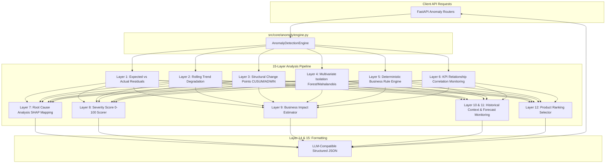

# Implementation Plan: Multi-Layer Anomaly Detection Engine

This plan details the architecture, math, modules, and API endpoints for a production-grade **Multi-Layer Anomaly Detection Engine** integrated within the existing ML calculation service.

---

## Proposed System Architecture

The anomaly detection engine will run as an independent package (`src/core/anomaly/`) consisting of modular sub-analyzers (Layers 1 through 12) combined by a central orchestration engine (`engine.py`).



---

## Technical Details by Layer

### Layer 1: Expected vs Actual (Residual Anomaly Detection)
* **Logic**: Predicts KPIs (Revenue, Orders, Profit, Conversion, Retention) using the trained LightGBM models for the given date.
* **Math**:
  * $\text{Residual} = \text{Actual} - \text{Prediction}$
  * $\text{Absolute Error} = |\text{Residual}|$
  * $\text{Percentage Error} = \frac{\text{Residual}}{\text{Actual} + 1e-5} \times 100$
  * $\text{Relative Error} = \frac{\text{Residual}}{\text{Prediction} + 1e-5}$
  * $\text{Standardized Residual} = \frac{\text{Residual}}{\text{Step Residuals Std}}$
  * $\text{Residual Z-score} = \frac{\text{Residual} - \text{Mean Residual}}{\sigma_{\text{residuals}}}$
* **Confidence Interval Check**: Checks whether `Actual` falls outside the 95% prediction interval $[ \text{Prediction} - 1.96 \cdot \text{std}, \text{Prediction} + 1.96 \cdot \text{std} ]$ using the saved step-by-step empirical standard errors.
* **Aggregation**: Supports daily, weekly, monthly, or custom windows.

### Layer 2: Rolling Trend Detection
* **Logic**: Monitors performance degradation over historical baselines for windows of 7, 14, 30, and 60 days.
* **Metrics**: Calculates rolling mean, rolling median, rolling standard deviation, rolling variance, rolling growth rate, and rolling momentum.
* **Comparisons**: Evaluates current window parameters against a baseline, calculating trend Z-score, trend percentage change, rolling drift, and trend confidence.
* **Flags**: Slow degradation, slow improvement, unstable periods, persistent decline, persistent growth.

### Layer 3: Change Point Detection
* **Logic**: Identifies structural mean/variance shifts in time-series data.
* **Algorithms**:
  * **CUSUM (Cumulative Sum)**: Runs dynamic change point tests.
  * **ADWIN (Adaptive Windowing)**: Dynamically adjusts windows to detect distribution changes.
  * **Ruptures / Bayesian Change Point**: Splits series into segments and checks difference in mean/variance before vs. after.
* **Outputs**: Returns the exact change day, confidence level, mean before/after, and variance before/after. Fully config-driven and modular.

### Layer 4: Multivariate Anomaly Detection
* **Logic**: Learns multivariate correlations and flags outliers/impossible combinations (e.g. Traffic goes up, but conversion and orders plummet).
* **Algorithms**: Isolation Forest, Mahalanobis Distance, Local Outlier Factor (LOF), and Robust Covariance (using `scikit-learn` estimators).
* **Feature Vector**: `[traffic, marketing_spend, inventory_available, avg_selling_price, discount_pct, current_ctr, current_roas, orders, revenue, profit, conversion_rate, retention_rate]`.
* **Outputs**: Multivariate anomaly score, nearest normal observations, distance from historical baseline, and feature contributions to the anomaly.

### Layer 5: Business Rule Engine
* **Logic**: Extensible, yaml-driven deterministic validation.
* **Default Rules**:
  * `Inventory = 0` AND `Orders > 0` $\rightarrow$ Impossible (Critical)
  * `Inventory < 0` $\rightarrow$ Impossible (High)
  * `Marketing doubled` AND `Revenue unchanged` $\rightarrow$ Campaign failure (Medium)
  * `Discount increased` AND `Orders decreased` $\rightarrow$ Pricing issue (High)
  * `CTR high` AND `Conversion collapsed` $\rightarrow$ Landing page issue (High)
  * `Traffic normal` AND `Orders collapsed` $\rightarrow$ Checkout issue (Critical)
  * `Profit negative` AND `Revenue increasing` $\rightarrow$ Margin issue (High)
  * `Shipping fee increased dramatically` AND `Conversion decreased` $\rightarrow$ Operational issue (Medium)
* **Extensibility**: Rules are loaded from `config/anomaly_rules.yaml`. Each rule has an ID, Description, Severity, Confidence, Business explanation, and Recommended action.

### Layer 6: KPI Relationship Monitoring
* **Logic**: Evaluates correlations and elasticities between KPIs over time.
* **Relations Checked**: Traffic $\rightarrow$ Orders $\rightarrow$ Revenue; Revenue $\rightarrow$ Profit; Marketing $\rightarrow$ Traffic; CTR $\rightarrow$ Conversion.
* **Math**: Calculates Pearson, Spearman, Distance Correlation, Rolling Correlation, and Mutual Information. Flags broken correlations, relationship drift, and conditional anomalies.

### Layer 7: Root Cause Analysis (RCA)
* **Logic**: Explains structural residuals using `shap.TreeExplainer` on the prediction models.
* **Translation**: Maps technical machine learning variables to clean business terms (e.g. `'marketing_spend'` $\rightarrow$ `'Marketing Spend'`). Summarizes top positive/negative drivers.

### Layer 8: Severity Score
* **Logic**: Combines all analytical layers into a unified composite score from `0` to `100`:
  * $\text{Severity} = w_1 \cdot \text{ResidualMagnitude} + w_2 \cdot \text{TrendStrength} + w_3 \cdot \text{RuleViolations} + w_4 \cdot \text{MultivariateScore} + w_5 \cdot \text{RelationshipDrift}$
* **Outputs**: Critical ($\ge 80$), High ($60$-$79$), Medium ($40$-$59$), Low ($20$-$39$), Informational ($<20$).

### Layer 9: Business Impact Estimation
* **Logic**: Estimates cumulative financial loss.
* **Estimation**: Quantifies Revenue Loss, Profit Loss, Order Loss, recovery time, opportunity cost, and projected future losses over daily, weekly, monthly, and custom projection windows.

### Layer 10 & 11: Historical Context & Forecast Monitoring
* **Logic**: Compares current anomaly properties (severity, KPI, duration) with historical events using a similarity distance.
* **Continuous Monitoring**: Compares prior forecast predictions with actual values as they arrive to log ongoing forecasting error/accuracy drift.

### Layer 12: Product Ranking
* **Logic**: Compiles anomalies across all products, categorizing and sorting products to surface:
  * Top 10 Critical Products
  * Top Revenue Risk
  * Top Profit Risk
  * Most Unusual Products
  * Products Recovering / Improving

### Layer 13, 14, 15: API, Response & LLM Compatibility
* **Logic**: API responses are structured JSON conforming to Pydantic schemas, ready to be synthesized by an LLM backend wrapper without raw processing.

---

## Proposed Changes

### Configuration Layer
#### [NEW] [anomaly_rules.yaml](file:///c:/Users/Relanto/OneDrive%20-%20Relanto/new/sprint2_product_intel/config/anomaly_rules.yaml)
* Contains the business rules (Layer 5) parameterized in YAML format.

---

### Core Anomaly Engine
#### [NEW] [residual.py](file:///c:/Users/Relanto/OneDrive%20-%20Relanto/new/sprint2_product_intel/src/core/anomaly/residual.py)
* Logic for Layer 1: calculates expected vs. actual values, relative error, Z-score, and prediction intervals.

#### [NEW] [rolling.py](file:///c:/Users/Relanto/OneDrive%20-%20Relanto/new/sprint2_product_intel/src/core/anomaly/rolling.py)
* Logic for Layer 2: calculates rolling mean, rolling median, standard deviation, drift, and momentum over 7d/14d/30d/60d.

#### [NEW] [changepoint.py](file:///c:/Users/Relanto/OneDrive%20-%20Relanto/new/sprint2_product_intel/src/core/anomaly/changepoint.py)
* Logic for Layer 3: CUSUM and ADWIN change point estimators in pure Python/SciPy.

#### [NEW] [multivariate.py](file:///c:/Users/Relanto/OneDrive%20-%20Relanto/new/sprint2_product_intel/src/core/anomaly/multivariate.py)
* Logic for Layer 4: fits Isolation Forest, LOF, and Mahalanobis distances over the multi-metric vector.

#### [NEW] [rules.py](file:///c:/Users/Relanto/OneDrive%20-%20Relanto/new/sprint2_product_intel/src/core/anomaly/rules.py)
* Logic for Layer 5: parses and evaluates the YAML business rules on incoming records.

#### [NEW] [relations.py](file:///c:/Users/Relanto/OneDrive%20-%20Relanto/new/sprint2_product_intel/src/core/anomaly/relations.py)
* Logic for Layer 6: monitors correlations and mutual information between metrics.

#### [NEW] [explain.py](file:///c:/Users/Relanto/OneDrive%20-%20Relanto/new/sprint2_product_intel/src/core/anomaly/explain.py)
* Logic for Layer 7 & 14: combines prediction explainer and feature translation for RCA.

#### [NEW] [severity.py](file:///c:/Users/Relanto/OneDrive%20-%20Relanto/new/sprint2_product_intel/src/core/anomaly/severity.py)
* Logic for Layer 8: computes combined weighted severity index.

#### [NEW] [impact.py](file:///c:/Users/Relanto/OneDrive%20-%20Relanto/new/sprint2_product_intel/src/core/anomaly/impact.py)
* Logic for Layer 9: computes financial losses and recovery projections.

#### [NEW] [history.py](file:///c:/Users/Relanto/OneDrive%20-%20Relanto/new/sprint2_product_intel/src/core/anomaly/history.py)
* Logic for Layer 10 & 11: similarity comparison against historical anomalies.

#### [NEW] [ranking.py](file:///c:/Users/Relanto/OneDrive%20-%20Relanto/new/sprint2_product_intel/src/core/anomaly/ranking.py)
* Logic for Layer 12: ranks products by metric/revenue/profit risks.

#### [NEW] [engine.py](file:///c:/Users/Relanto/OneDrive%20-%20Relanto/new/sprint2_product_intel/src/core/anomaly/engine.py)
* The central `AnomalyDetectionEngine` that wires all sub-modules together.

---

### API Routing & Schemas
#### [NEW] [anomaly.py](file:///c:/Users/Relanto/OneDrive%20-%20Relanto/new/sprint2_product_intel/src/api/routers/anomaly.py)
* Declares routes and handler functions for POST `/anomaly/detect`, `/anomaly/product`, `/anomaly/category`, etc.

#### [NEW] [anomaly.py](file:///c:/Users/Relanto/OneDrive%20-%20Relanto/new/sprint2_product_intel/src/api/schemas/anomaly.py)
* Declares Pydantic schemas for request payloads and JSON response structures.

#### [MODIFY] [dependencies.py](file:///c:/Users/Relanto/OneDrive%20-%20Relanto/new/sprint2_product_intel/src/api/dependencies.py)
* Instantiates `AnomalyDetectionEngine` and exposes it via `get_anomaly_engine()` dependency injection.

#### [MODIFY] [main.py](file:///c:/Users/Relanto/OneDrive%20-%20Relanto/new/sprint2_product_intel/src/api/main.py)
* Registers the new `anomaly.router` under `/api/v1` prefix.

---

## Verification Plan

### Automated Tests
* We will create a comprehensive test suite `tests/test_api/test_anomaly.py` containing integration tests for:
  * Metric residual calculation (Layer 1)
  * Business rules evaluation (Layer 5)
  * API endpoints correctness (FastAPI test client checks for `/anomaly/detect`, `/anomaly/product`, etc.)
  * Boundary test cases (null inputs, empty data slices, invalid product IDs)

To run the new tests:
```bash
.\myenv\Scripts\python -m pytest tests/test_api/test_anomaly.py
```

### Manual Verification
* Deploy the microservice locally using `python run.py`.
* Query the Swagger API at `http://127.0.0.1:8000/docs` to test query payloads and verify the structured JSON responses match the exact formats requested.
