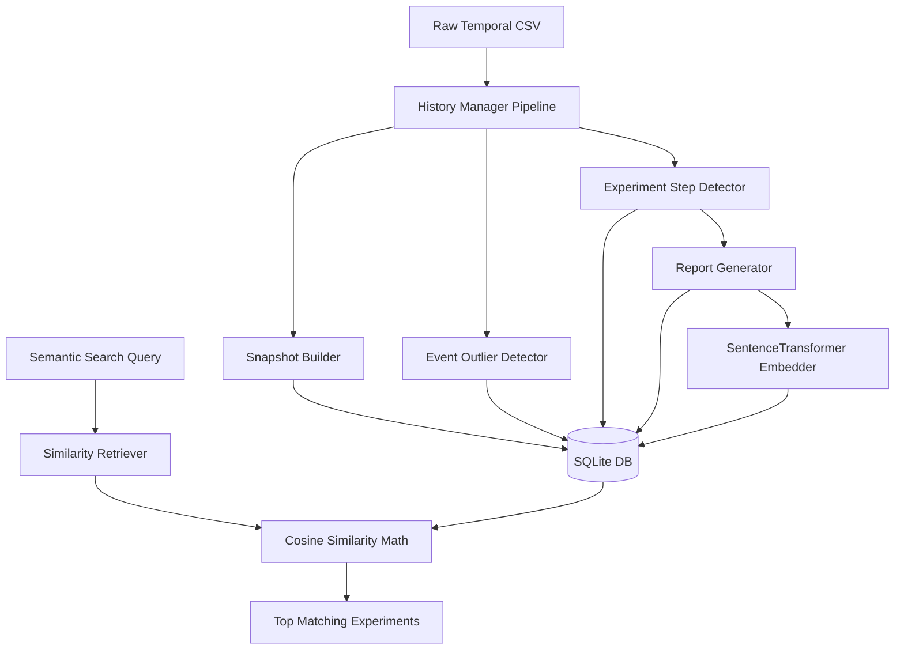
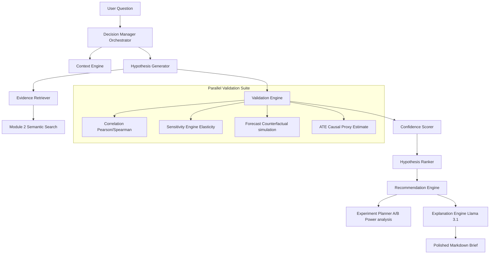

# Technical Component Documentation: Modules 2 & 3

This document provides a highly detailed technical breakdown of every component built under **Module 2 (Historical Intelligence Repository)** and **Module 3 (AI Decision Intelligence Engine / AI Scientist)**, explaining how they work, the algorithms and libraries used, and their corresponding files.

---

## Part 1: Module 2 - Historical Intelligence Repository (Business Memory Engine)

The Historical Intelligence Repository acts as the automated "business memory" of the organization. It processes historical datasets, detects anomalies (Events) and step-changes (Experiments), generates human-readable summaries, and indexes them using vector embeddings for semantic search.

### 1.1. Ingestion Pipeline & DB Schemas
* **Files**:
  - [models.py](file:///C:/Users/Relanto/OneDrive%20-%20Relanto/new/sprint2_product_intel/src/core/history/storage/models.py): Declares ORM classes mapped to SQLite tables.
  - [database.py](file:///C:/Users/Relanto/OneDrive%20-%20Relanto/new/sprint2_product_intel/src/core/history/storage/database.py): Establishes SQLAlchemy connection sessions.
* **Mechanism**:
  - Uses SQLAlchemy to manage connections. The tables are automatically initialized upon FastAPI application lifespan startup via `Base.metadata.create_all(bind=engine)`.
  - **Data Models**:
    - `snapshots`: Daily aggregated KPIs (`total_revenue`, `total_profit`, `total_orders`, `mean_conversion_rate`, `mean_retention_rate`, `total_marketing_spend`, `channel_mix`, etc.).
    - `events`: Outliers detected in the timeline with reasons, severity levels, and affected KPIs.
    - `experiments`: Identified step-change modifications with significance values ($p$-value, improvement rate, pre/post means).
    - `reports`: Detailed business reports containing structured lessons, recommendations, and executive markdown text.
    - `report_embeddings`: 384-dimensional floating-point vectors representing report texts.

### 1.2. Snapshot Builder
* **Files**:
  - [snapshot.py](file:///C:/Users/Relanto/OneDrive%20-%20Relanto/new/sprint2_product_intel/src/core/history/builders/snapshot.py)
* **Mechanism**:
  - Aggregates daily observations from transactional CSV lines.
  - Computes period growth metrics relative to the previous day's product sales.
  - Saves structural details like `channel_mix` (Amazon, Direct website, Nykaa, Mobile App) and `campaign_mix` (Search, Social, Email, Affiliate) as JSON string columns.

### 1.3. Event Outlier Detector
* **Files**:
  - [event.py](file:///C:/Users/Relanto/OneDrive%20-%20Relanto/new/sprint2_product_intel/src/core/history/detectors/event.py)
* **Mechanism**:
  - Scans historical metrics using rolling window statistics (30-day window).
  - Calculates a rolling Z-score:
    $$Z = \frac{x_t - \mu_{30}}{\sigma_{30}}$$
  - Identifies statistical anomalies if $|Z| > 2.0$ (adjustable threshold).
  - Classifies events by severity (High/Medium) and assigns reasons (e.g. "Conversion Rate dropped by 4.2% relative to historical average").

### 1.4. Experiment Step-Change Detector
* **Files**:
  - [experiment.py](file:///C:/Users/Relanto/OneDrive%20-%20Relanto/new/sprint2_product_intel/src/core/history/detectors/experiment.py)
* **Mechanism**:
  - Identifies step-changes in key parameters (price, discount, marketing spend) on a rolling basis.
  - When a parameter shift exceeds 15%, it defines a **treatment date**.
  - Splits the timeline into a **Pre-intervention window** (14 days before) and a **Post-intervention window** (14 days after).
  - Calculates statistical significance of target KPI shifts using **Welch's Two-Sample T-Test** (which accommodates unequal variances and sample sizes):
    $$t = \frac{\bar{X}_1 - \bar{X}_2}{\sqrt{\frac{s_1^2}{N_1} + \frac{s_2^2}{N_2}}}$$
  - Returns degrees of freedom and $p$-values. Experiments with $p < 0.05$ are cataloged as statistically significant.

### 1.5. Report Generator
* **Files**:
  - [generator.py](file:///C:/Users/Relanto/OneDrive%20-%20Relanto/new/sprint2_product_intel/src/core/history/reports/generator.py)
* **Mechanism**:
  - Translates experiment data into a human-readable business summary.
  - Utilizes a local template engine to output structured findings, learnings, risk assessments, and recommendations if the LLM client is busy or rate-limited.

### 1.6. SentenceTransformer Embedder
* **Files**:
  - [encoder.py](file:///C:/Users/Relanto/OneDrive%20-%20Relanto/new/sprint2_product_intel/src/core/history/embeddings/encoder.py)
* **Mechanism**:
  - Loads the `all-MiniLM-L6-v2` SentenceTransformer model locally via Hugging Face weights.
  - Converts text strings into 384-dimensional dense vectors.
  - Serializes arrays into double-precision float blobs for binary storage in SQLite.

### 1.7. Semantic Similarity Retriever
* **Files**:
  - [similarity.py](file:///C:/Users/Relanto/OneDrive%20-%20Relanto/new/sprint2_product_intel/src/core/history/retrievers/similarity.py)
* **Mechanism**:
  - Encodes search query strings into vectors.
  - Fetches all embeddings from the database.
  - Computes the **Cosine Similarity** between the query vector $A$ and report vectors $B$:
    $$\text{Similarity} = \frac{A \cdot B}{\|A\|\|B\|}$$
  - Sorts, filters, and returns the top $K$ matching historical reports.

---

## Part 2: Module 3 - AI Decision Intelligence Engine (AI Scientist)

The AI Scientist parses strategic business questions, maps them to driver parameters, validates them across multiple modeling engines (forecasts, elasticity, causal proxies), scores them, ranks them, and drafts prioritized business recommendations and A/B test power analysis plans.

### 2.1. Context Assembly Engine
* **Files**:
  - [engine.py](file:///C:/Users/Relanto/OneDrive%20-%20Relanto/new/sprint2_product_intel/src/core/decision/context/engine.py)
* **Mechanism**:
  - Retrieves latest snapshots to construct current baseline KPI aggregates.
  - Queries active anomalies (Events) within a recent 30-day window.
  - Computes rolling growth slopes to establish baseline performance trajectories.

### 2.2. Candidate Hypothesis Generator
* **Files**:
  - [generator.py](file:///C:/Users/Relanto/OneDrive%20-%20Relanto/new/sprint2_product_intel/src/core/decision/hypothesis/generator.py)
* **Mechanism**:
  - Analyzes queries using heuristics and regular expressions (e.g. detecting keywords like "discount", "price", "shipping", "marketing").
  - Formulates candidate hypotheses matching these drivers (e.g. "Excessive discounts erode net Profitability", "Price increases decrease Customer Conversion").
  - Identifies target KPIs (e.g. conversion, profit, orders) and sets prior probability values.

### 2.3. Evidence Retriever
* **Files**:
  - [retriever.py](file:///C:/Users/Relanto/OneDrive%20-%20Relanto/new/sprint2_product_intel/src/core/decision/evidence/retriever.py)
* **Mechanism**:
  - Calls `HistoryManager.semantic_search` to query the vector database.
  - Retrieves the top similar past experiments, identifying their outcomes and average statistical confidence.

### 2.4. Validation Engine (Parallel ML Verification Suite)
* **Files**:
  - [validator.py](file:///C:/Users/Relanto/OneDrive%20-%20Relanto/new/sprint2_product_intel/src/core/decision/validation/validator.py)
* **Mechanism**:
  - Executes four validation check methods:
    1. **Correlation**: Calculates Pearson ($r$) and Spearman ($\rho$) coefficients to assess linear/non-linear historical associations.
    2. **Sensitivity**: Pulls elasticity metrics ($\frac{\partial Y}{\partial X}$) from the core `SensitivityEngine`.
    3. **Forecast Counterfactual**: Overrides values (e.g., $+10\%$ or $-10\%$ change in discount_pct or avg_selling_price) inside the recursive LightGBM predictor, runs the 14-day forecaster, and compares cumulative results to baseline forecasts to compute the expected impact delta.
       * *Type Casting*: Autodetects the pandas column data type and casts overrides (e.g. converting float percentages to integers for columns like `discount_pct`) to avoid preprocessor typing errors.
    4. **Causal Estimate**: Performs a median-split treatment partition on the driver variable, evaluates treatment vs control groups on the target KPI, and computes an average treatment effect (ATE) proxy along with Welch's T-test $p$-value.

### 2.5. Confidence Scorer
* **Files**:
  - [scorer.py](file:///C:/Users/Relanto/OneDrive%20-%20Relanto/new/sprint2_product_intel/src/core/decision/confidence/scorer.py)
* **Mechanism**:
  - Scores validation checks from 0.0 to 1.0 (evaluating correlation coefficients, forecast overlap, ATE significance).
  - Computes a weighted overall confidence rating:
    $$C = w_{hist} \cdot E_{hist} + w_{corr} \cdot E_{corr} + w_{sens} \cdot E_{sens} + w_{fore} \cdot E_{fore} + w_{caus} \cdot E_{caus}$$
  - Returns a detailed textual reasoning breakdown.

### 2.6. Hypothesis Ranker
* **Files**:
  - [ranker.py](file:///C:/Users/Relanto/OneDrive%20-%20Relanto/new/sprint2_product_intel/src/core/decision/ranking/ranker.py)
* **Mechanism**:
  - Ranks hypotheses using a composite rank score combining the confidence rating and expected absolute business impact:
    $$\text{Rank Score} = w_c \cdot \text{Confidence} + w_i \cdot \text{Impact Score}$$

### 2.7. Recommendation Engine
* **Files**:
  - [engine.py](file:///C:/Users/Relanto/OneDrive%20-%20Relanto/new/sprint2_product_intel/src/core/decision/recommendation/engine.py)
* **Mechanism**:
  - Converts ranked hypotheses to business actions (e.g., promotional campaigns, pricing adjustments, fulfillment optimizations).
  - Sets risk priority categories (High/Medium/Low), estimates ROI metrics, and details safe rollback guidelines.

### 2.8. Experiment Planner (Power Analysis statistics)
* **Files**:
  - [ab_planner.py](file:///C:/Users/Relanto/OneDrive%20-%20Relanto/new/sprint2_product_intel/src/core/decision/planner/ab_planner.py)
* **Mechanism**:
  - If a recommendation's validation confidence score is low ($C < 0.70$), it triggers this module to plan a verification experiment.
  - Estimates required sample size ($N$) using standard statistical power analysis equations (for significance level $\alpha=0.05$ and power $1-\beta=0.80$, requiring $Z_{\alpha/2}=1.96$ and $Z_{\beta}=0.84$):
    $$N = 2 \cdot \left(Z_{\alpha/2} + Z_{\beta}\right)^2 \cdot \frac{\sigma^2}{\text{MDE}^2} \approx 16 \cdot \frac{\sigma^2}{\text{MDE}^2}$$
  - Calculates baseline variance $\sigma^2$ from the historical dataset.
  - Suggests testing durations (in days) to prevent seasonality leakage.

### 2.9. Business Explanation Engine
* **Files**:
  - [explainer.py](file:///C:/Users/Relanto/OneDrive%20-%20Relanto/new/sprint2_product_intel/src/core/decision/explanation/explainer.py)
* **Mechanism**:
  - Assembles ranked hypotheses, validation values, and actionable guidelines.
  - Invokes Llama-3.1-70b-instruct to compile a polished markdown executive brief.
  - Automatically falls back to a clean local string-builder template if the network API is unreachable.
